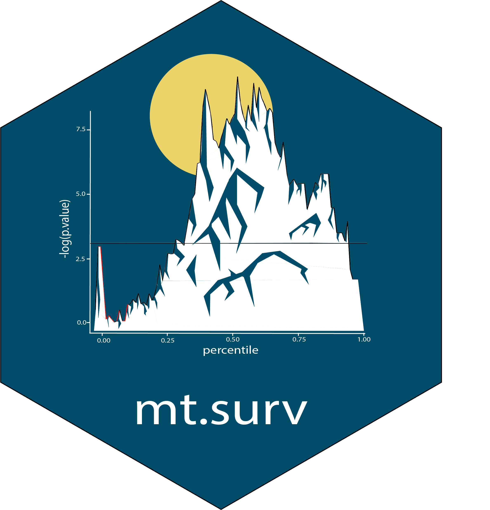

# mt.surv 

## Multi-threshold survival analysis 

[](https://zenodo.org/badge/latestdoi/476856711)    


## Overview

This package contains functions to apply multi-threshold survival analysis on count data (e.g. microbe abundances, gene expression), using (1) survival information and (2) counts.

`survivalByQuantile` generates a table with cox analysis parameters at various threshold quantile

`calculateArea` integrates the area above a 0.05 log likehood p-value threshold and outputs a scalar that can be used to rank the importance of different features

`ToWide` converts the count matrix reads from long format to wide format


## Installation

``` r
# Currently available as the development version on GitHub
install.packages("devtools")
devtools::install_github("spakowiczlab/mt.surv")
```

## References

1. Andersen, P. and Gill, R. (1982). Cox's regression model for counting processes, a large sample study. Annals of Statistics 10, 1100-1120.

2. Therneau, T., Grambsch, P., Modeling Survival Data: Extending the Cox Model. Springer-Verlag, 2000.

_submitted_
